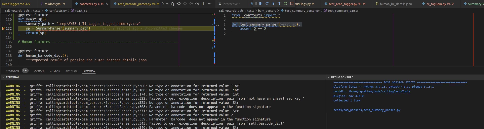
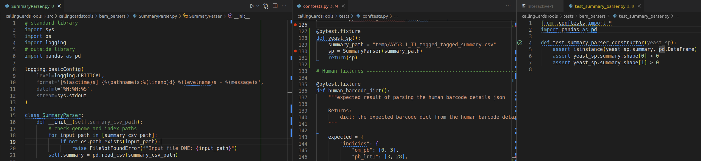
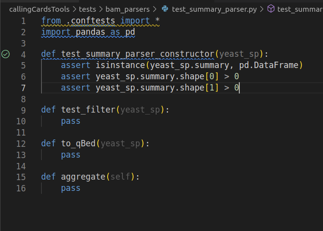

# Tests are reproducible debugging tools!

There is a test suite provided with this package which is intended to give 
any future Calling Cards developers who might use this an easier way into the 
code. All code should be accessible from the current tests, and the current 
tests can be used to give some assurance that a new change doesn't absolutely 
break any functionality.  

__However__, the purpose of the tests is not to prove correctness. Rather, 
it is a record of the debugging that I have done. It makes the debugging 
reproducible!  

The real benefit to me in the future, or you, if you have inherited this, 
is that you can use VScode to set breakpoints in the code. This means you 
don't have to read my documentation or guess at what I was trying to do.  

Here is an example:

What you're seeing here is a a dummy test on the right. Notice that this 
test does nothing! it just says that 2 == 2. However, it is importing 
a _fixture_. A fixture is a test data object -- in this case, it is a 
SummaryParser object that is loaded from test data that is provided in the 
package repository.  

Notice that I have set a breakpoint on the `SummaryParser()` constructor. This 
isn't necessarily the most direct way or setting up this test, but it provides 
an example of both a fixture, and proves that tests don't need to actually 
test anything at all to be useful.  

Why is this useful? Because now you can "step into" the SummaryParser 
constructor. When I wrote the constructor, I needed to make sure that it 
actually constructs. We do that by trying it out. Because I have provided this 
"test", you can re-run that debugging process as many times as you wan to. You 
don't need to read the documentation on what the SummaryParser() is supposed 
to do -- just set a breakpoint and run the test -- the execution will stop at 
the breakpoint and you'll be in an interactive coding environment.  

By doing this, as a developer, you can interatively improve the tests over 
time. As you debug, upon first writing or at any point in the future when you 
are debugging, just keep a record (that is the iteratively improved test). 
For example, maybe you write a more robust test of the constructor:

As you write the rest of the class, you'll want to make sure that you're 
including tests. At the _very very_ least, provide the names of the tests:

If you're good, then you'll write this tests firsts, and then write the 
function. But most of us are mere mortals, and will write the functional code 
and the tests concurrently. You do this already, most likely -- write and test 
in an interactive environment, and then copy/paste the working function into 
your production environment -- the only difference between that, and using the 
testing framework, is that by using the testing framework, you're providing a 
resource to yourself-in-the-future, and possibly other developers.